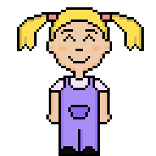

## Laberinto con pygame
Hermanos! un cuento de risas
## Historia
Dos niños están jugando en un hermoso jardín. De repente, el juguete favorito de uno de los niños se rompe, y comienza a llorar. La niña, queriendo animarlo, decide recorrer el jardín en busca de cosas divertidas para hacer reír al niño. Mientras recorre el jardín, se encuentra con diferentes obstáculos y desafíos que debe superar para encontrar las cosas que harán reír al niño. El objetivo del juego es ayudar a la niña a superar estos obstáculos y encontrar las cosas más divertidas para hacer reír al niño y restaurar su felicidad
## Funcionalidades
- **Movimiento de la hermana:** Utiliza las teclas de flecha para mover a la hermana hacia arriba, abajo, izquierda o derecha.
- **Final del Juego:** El juego finaliza cuando la hermana encuentre la salida del jardín y recolecta todos los objetos antes de que se termine el tiempo.
## Requisitos
1. Python 3.6 o superior
2. Librería Pygame
## Pasos para jugar
1. Abre la ventana del juego.
2. Utiliza las teclas de flecha (↑, ↓, ←, →) para mover a la hermana.
3. Guía a la hermana hacia la salida del jardín evitando las paredes y recogiendo los objetos.
4. Una vez la hermana alcance la salida antes de que termine el tiempo, se mostrará un mensaje de victoria, caso contrario uno de pérdida.
## Estructura del Proyecto
- Images/: Contiene las imágenes, frames (aun sin utilizar) que tiene el juego.
- Audio/: Contiene el audio que tiene el juego
- laberinto.py: El archivo principal que contiene el código del juego.
## Demostración
**Personaje**

**Win/GameOver**
 
## Créditos
Al tutorial de Santiago Lasso que sirvió de ayuda para realizar este proyecto.
## Agradecimientos
Agradezco al evento Global Game Jam por animarme a realizar un juego no competitivo. A mis compañeros de equipo, Patricio, Freddy y David,  por aportar con su arte, ya sea en la música o ilustraciones. A mi hermano por ser el que realizaba las pruebas del juego. 
